# Project Travel Memory Application Deployment

## Divided in 4 Sections
A. EC2 setup for deployment and hosting through NGINX server & reverse proxy.

B. Setting up sub domains for frontend and backend that proxies through Cloutflare by adding a 'A' record.

C. Setting up Load-Balancer for 'frontend' and 'backend' EC2 application servers.

D. Architecture diagram using draw.io

#

## A. Infra Setup For Deployment
1. Launch 4 EC2 Ubuntu Instances depending on your compute requirement.
    
    a. Two for frontend application and another two for backend application.
    
    b. After launching instances you can see instances spunned up. 
    
    c. Note:- Instances should be inside same VPC, with inbound and outbound traffic open to the internet via http (port 80) or https (port 443).
    
    d. Enable ssh connection in both the instances. 
    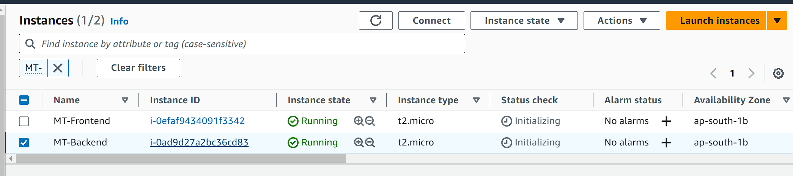

2. Connect backend instance and setup requirements manually for deploying and running the application using amazon ec2 console.
        
    a. Update apt-get package installer
            
        sudo apt-get update -y
        
    b.  clone the repository using below command

        git clone https://github.com/UnpredictablePrashant/TravelMemory.git
        
    c. Install node v18 in-order to run backend application, below steps will install nodejs and npm
        
        sudo snap install node --classic -y
    
        
    d. Install nginx in ec2 backend instace

        sudo apt-get install nginx -y 
        
        sudo systemctl start nginx
        
    f. Navigate to TravelMemory/backend/ directory and create a .env file 
        
        Run `sudo nano .env`

    Paste the below content in the file
        
        MONGO_URI='mongodb+srv://<username>:<password>@cluster0.wbha2pq.mongodb.net/DevopsTravelMemory'
        PORT=80

    Can get the database connection string from 
    https://cloud.mongodb.com/

    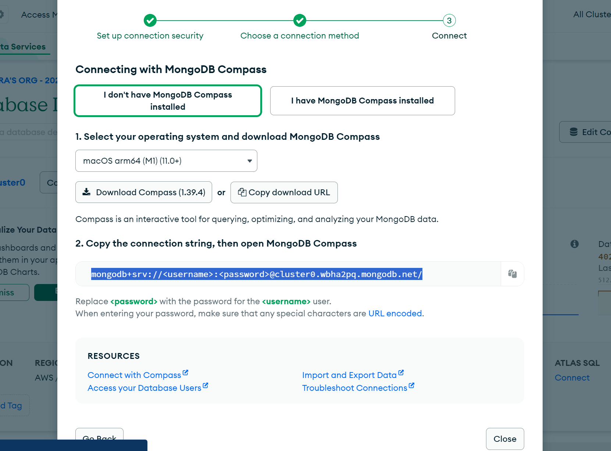
        
    g. Save the file and run command to install all the dependencies of backend application
            
        sudo npm install
        
    h. Now start the backend application through running command

        sudo npm run start

    Output in the console will look like below screenshot

    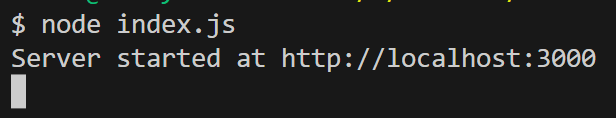

    Cool!! Our backend application is now running at port 3000, but notice that while creating EC2 instance, we opened the port 80 and 443 for outside world.

    So the question is how can we forward the request coming at port 80 or 443 of the instance be forwarded to port 3000.?

    This is where NGINX comes into picture and our time for configuring the nginx server as an solution to the above problem!!

    i. Navigate to nginx folder

        cd /etc/nginx/sites-enabled
        sudo nano default

        server {
        listen 80;
        listen [::]:80;
            
        location / {
            proxy_pass http://localhost:3000;
            include proxy_params;
            }
        }

    Save the file and exit editor and run command to reload nginx server

        sudo systemctl reload nginx

    j. Change directory to ubuntu/TravelMemory/backend and start the backend application
        
        sudo node index.js

3. Connect frontend instance and setup requirements manually for deploying and running the application using amazon ec2 console.
        
    a. Update apt-get package installer first
    
        sudo apt-get update -y
        
    b. Clone the repository using below command
         
        git clone https://github.com/UnpredictablePrashant/TravelMemory.git
        
    c. Install node v18 in-order to run frontend application, below steps will install nodejs and npm
        
        sudo snap install node --classic -y
    
        
    d. Install nginx in ec2 frontend instance

        sudo apt-get install nginx -y
        
        sudo systemctl start nginx
    
    e. Navigate to TravelMemory/frontend/src directory and edit the url.js file
        
        sudo nano url.js

    Paste the below content in the file

        export const baseUrl = "http://<public-ip-address-of-backend-instance>"
    
    f. Save the file and run command to install all the dependencies of frontend application, inside frontend directory
            
        sudo npm install
        
    h. Now start the frontend application through running command

        sudo npm run start

    Output in the console will look like below screenshot\

    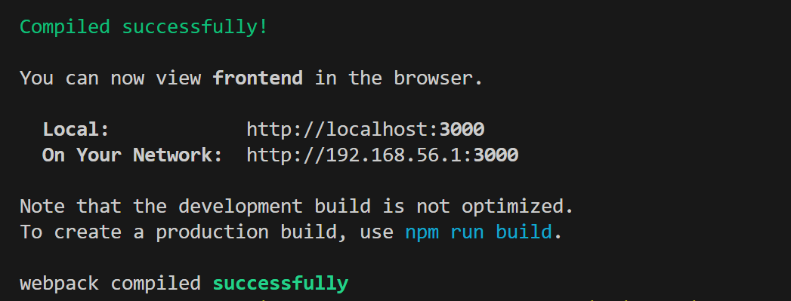

    i. Repeat step (2.i) for port forwarding

    j. Now open the browser and hit the frontend ip-address in the URL bar

        https://<ip-address-of-frontend>/
    
    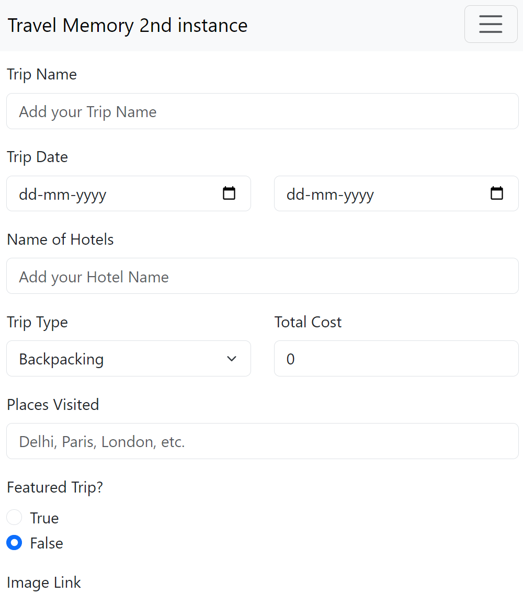

    Voila!! Your frontend application is working now, edit the fields and submit a record in the mongo database.

#
## B. Setting up domains for frontend and backend that proxies through Cloutflare

Create an account in the cloudflare and follow below steps to set up subdomains for your front and back end instance.
    `https://dash.cloudflare.com/`

a. Once you logged in click on create website button
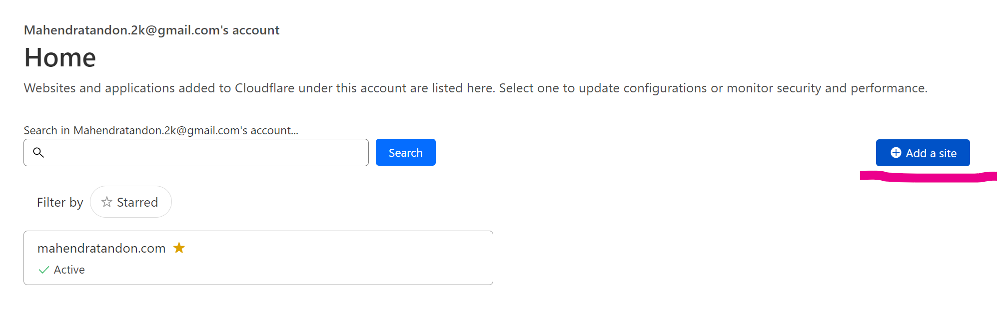

b. Enter your purchased domain to add it in the cloudflare
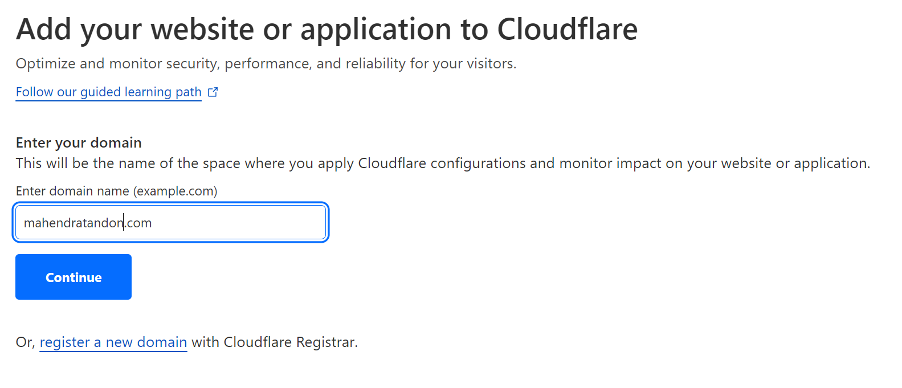

c. If you dont have a web domain then you can get one by clicking the link given in the bootm of the content section
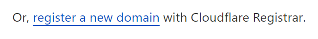

d. Now on the home page you can see your website status as active click on it to goto you website configuration
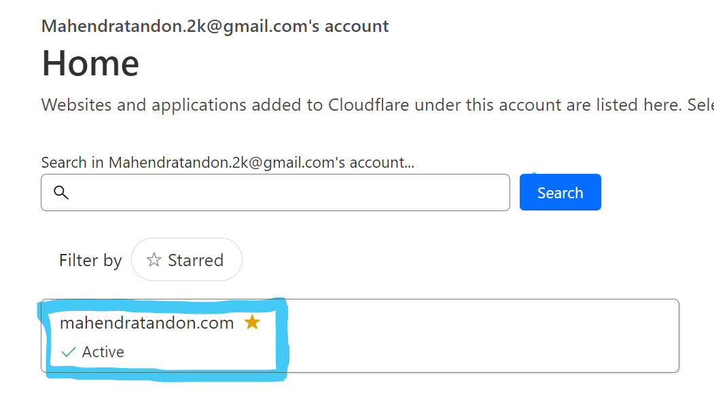

e. Click on DNS section on the left hand side menu to go to DNS configuration 
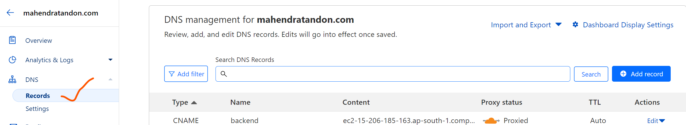

f. Click on add a record so that we can create subdomains of our primary domain in my case
    
    Primary Domain- mahendratandon.com
    
    Sub Domain Backend - backend.mahendratandon.com

    Sub Domain Frontend - frontend.mahendratandon.com

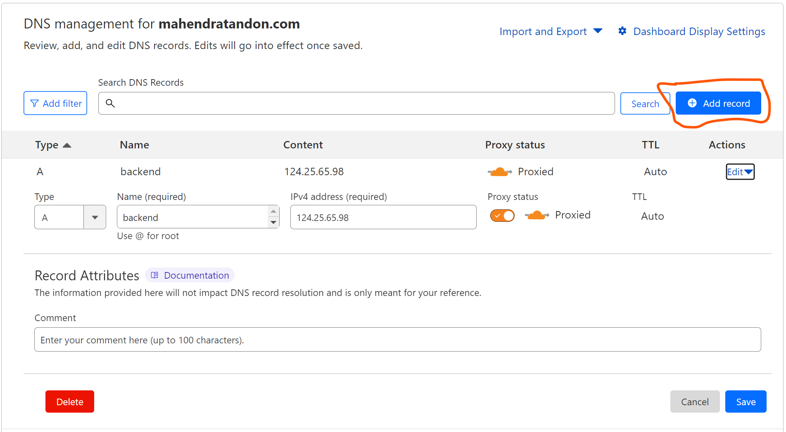

g. Setup two 'A' record with the instance's ip address

    Select Type as 'A', Name as 'backend' and Content as [ec2-ip-address-of-backend]

    Select Type as 'A', Name as 'bacfrontendkend' and Content as [ec2-ip-address-of-frontend]

h. Hit save and you are good to go for accessing the frontend website through the custom domains. i.e.

    https://frontend.mahendratandon.com

i. Change the 'url.js' file in frontend EC2 instance and update the baseURI and restart the frontend application by repeating step `(1.3.h)`

    export const baseUrl=https://backend.mahendratandon.com

#
## C. Setting up Load-Balancer (ELB) for 'frontend' and 'backend' EC2 application servers

For setting up loadbalancers, we need to understand how many loadbalancers we need for our application. In our case we want two load balancers one for frontend and other for backend.

1. Setting up frontend loadbalancer (Frontend facing) 

    a. Login to EC2 console and search for loadbalancers you will see the home page.

    b. Click on create load balancer button on the top right
    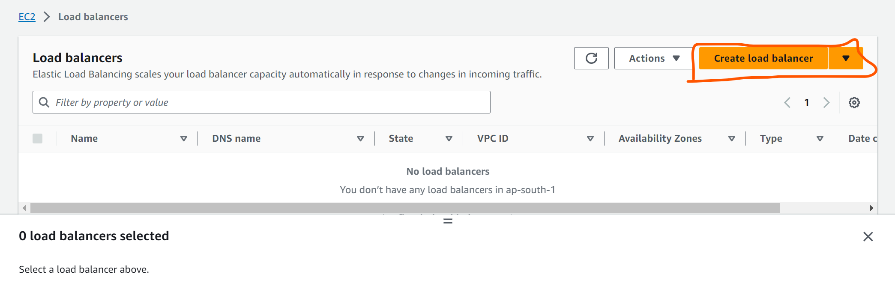

    c. You will see three options to select a type of loadbalancer. In our case we will go with 'Application Loadbalancer'. As, we want to distribute traffic coming from our Internet to our frontend EC2 instance's. Click on "Create Button"
    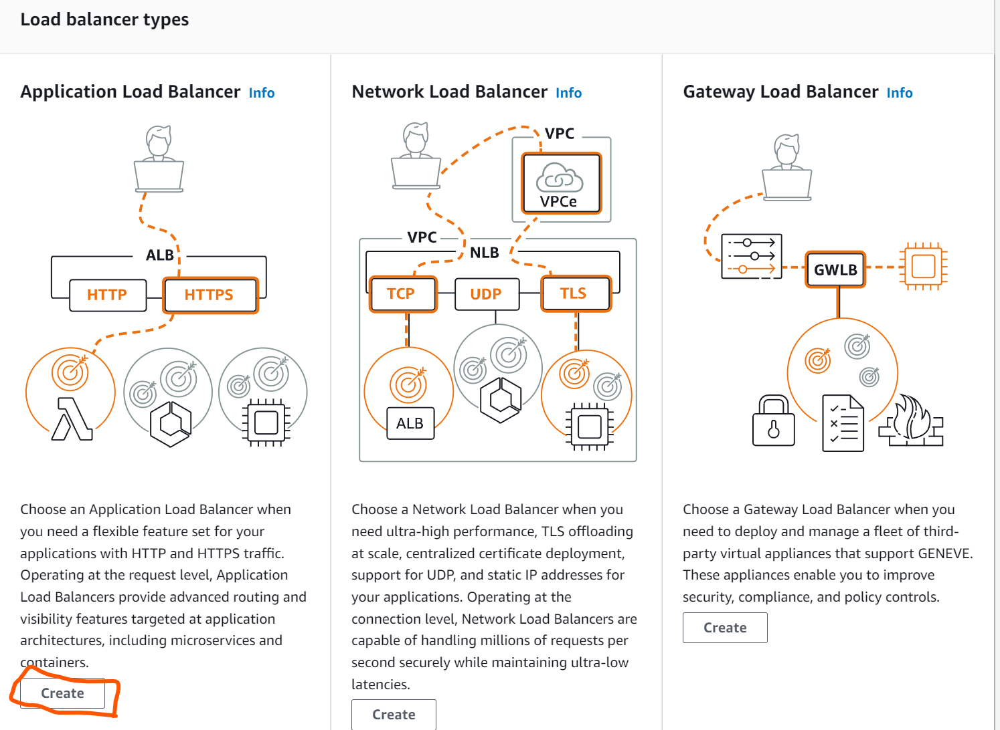

    To learn more about application loadbalancer and its differences from classic load balancer, can refer https://docs.aws.amazon.com/elasticloadbalancing/latest/application/introduction.html

    d. Select a unique name for idenfication of the ELB, and select internet-facing option in Scheme section.
    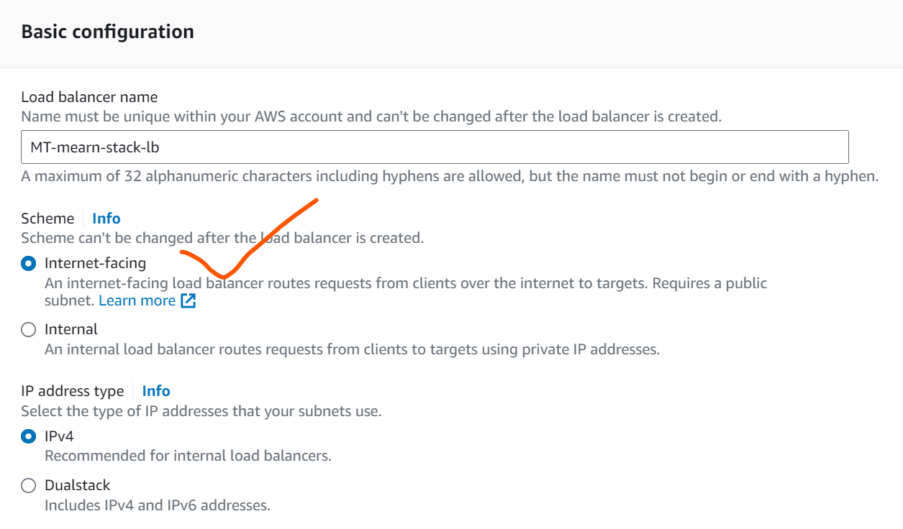

    e. Now configure Network Mapping in which we need to select a VPC (Virtual Private Cloud) in which we created the EC2 instances, You can identify the VPC by going to EC2 > Instance > Select your instance and see down below for your VPC
    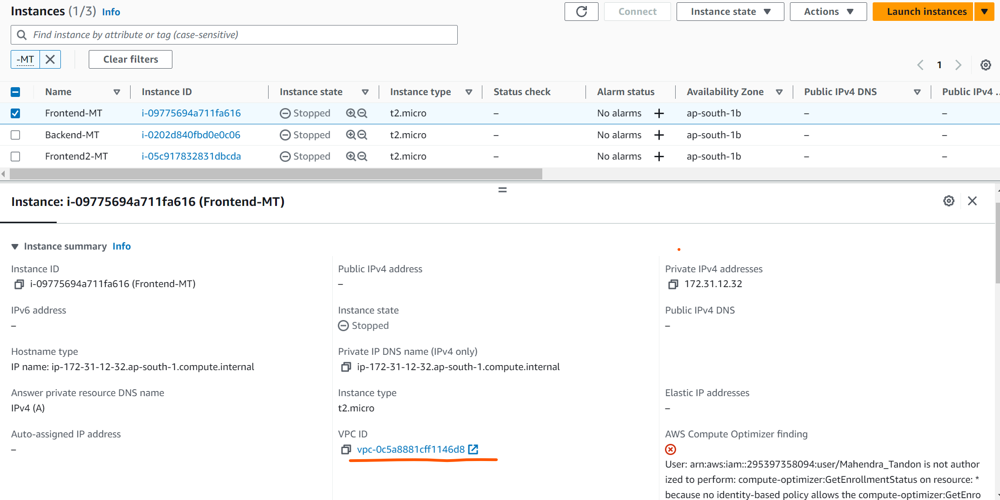

    Select your VPC from the drop down and select number of availability zones, and select the default security group. 
    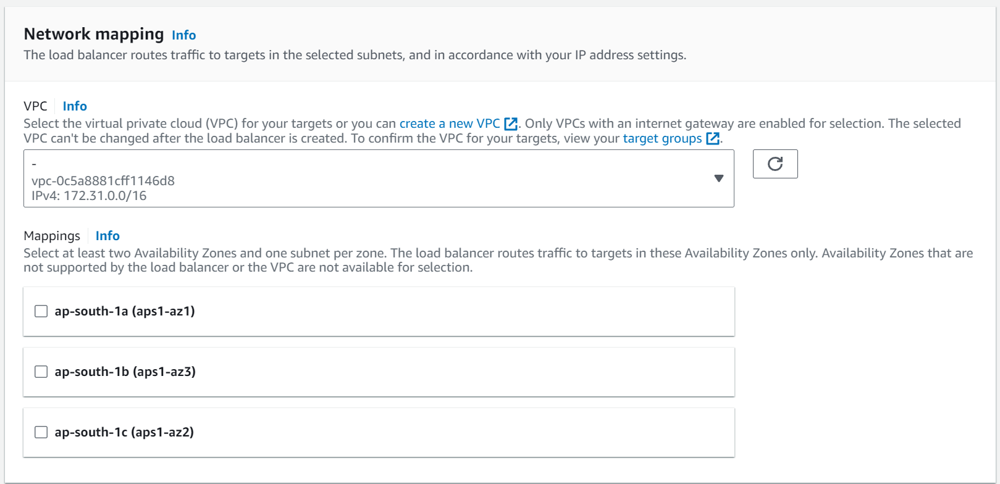

    f. Now, we need to configure listeners for our ELB. A listener is a process that checks for connection requests using the port and protocol you configure. The rules that you define for a listener determine how the load balancer routes requests to its registered targets.
    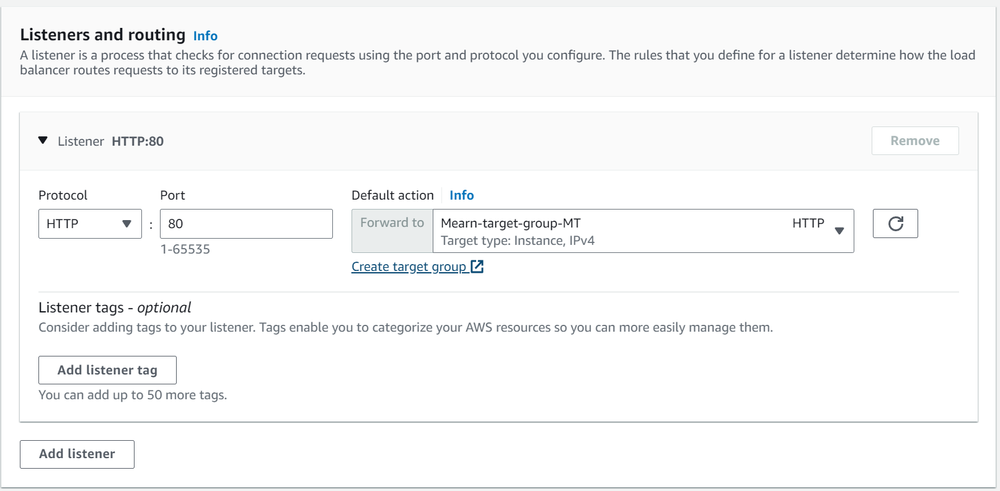

    For creating a listener you need a target group. Your load balancer routes requests to the targets in a target group and performs health checks on the targets.
    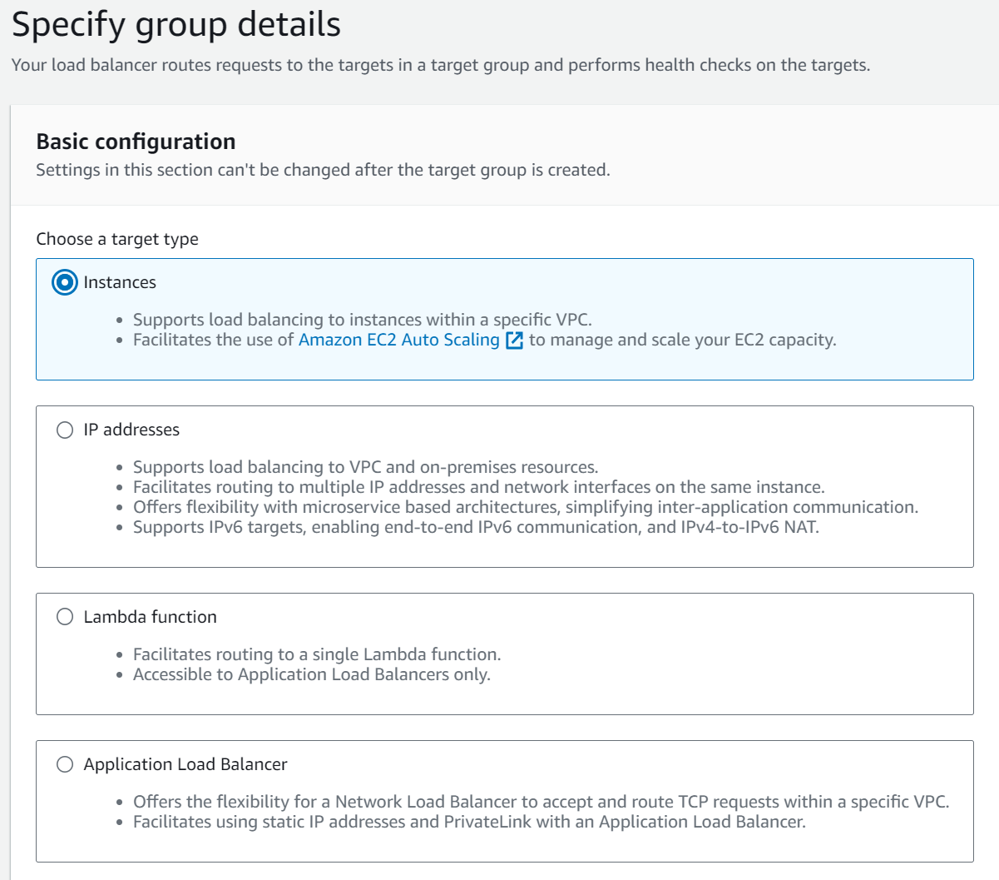

    Select the TWO frontend instances, add a unique target group name and protocol should be http1 and port is 80, where your request will come when we hit frontend URL. Click next and select your instance from the list click on include as pending and then click on create target group.
    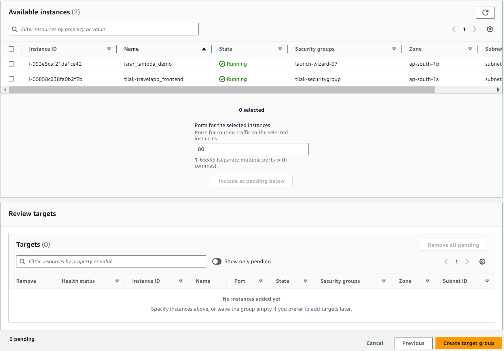

    Now your target group is created successfully. Select the target group by going to (Step C.1.f)

    g. Click on create load balancer
    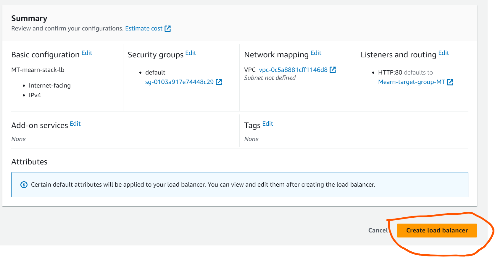

    Go back to loadbalancers page and you can see that your ELB is created successfully. Select you ELB and at the bottom you could see "DNS name" that is available for adding an 'CNAME' record. Copy that.
    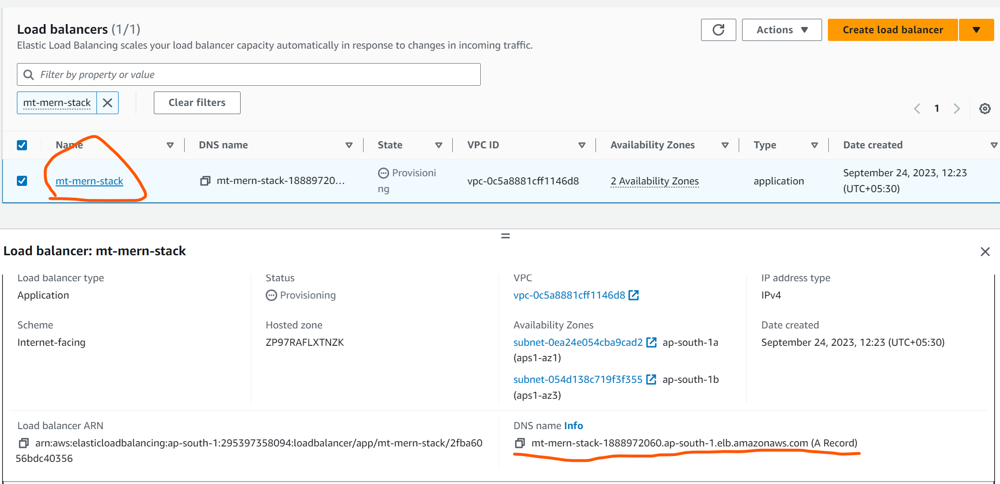

    h. Goto your cloud flare portal and select your website, then goto DNS menu and add CNAME record
    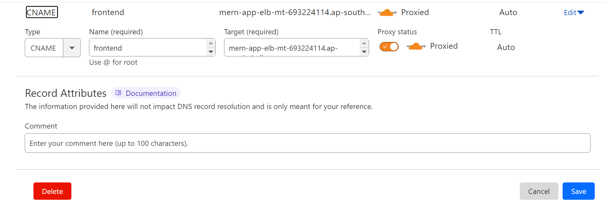

    Click on save and you will be able to access your frontend url and traffic will route through through your ELB to your target group. Done!!
    

2. Setting up backend loadbalancer (Internal facing)

    a. Login to EC2 console and search for loadbalancers you will see the home page.

    b. Click on create load balancer button on the top right.
    

    c. You will see three options to select a type of loadbalancer. In our case we will go with 'Application Loadbalancer'. As, we want to distribute traffic coming from our Internet to our frontend EC2 instance's. Click on "Create Button".
    

    d. This time select internal for SCHEME section so that it sits between your frontend instances and backend instances. 
    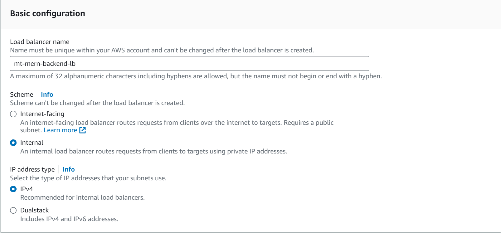

    e. Follow step (C.1.e) to (C.1.g) for creating a target group for backend and adding it to the load balancer.

    f. Goto your cloud flare portal and select your website, then goto DNS menu and add CNAME record
    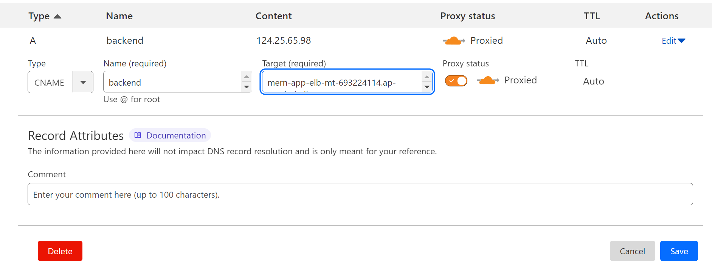

    g. Now, edit your frontend instance and update the URL.js to the internal ELB ip address that you will get from loadbalancer. Given in step (A.3.e), Restart the fronend application.

    Click on save and you are done setting up internal ELB for backend. Traffic from frontend will route through through your internal ELB to your target group. Done!!

#
## D. Architecture diagram using draw.io
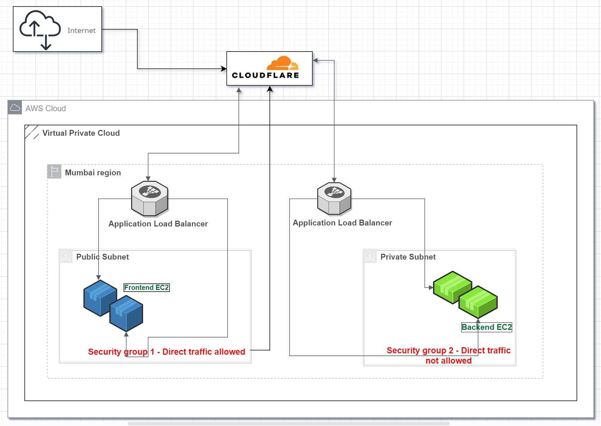